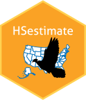

<!-- README.md is generated from README.Rmd. Please edit that file -->

# HSestimate 

## Overview

The Harvest Survey estimation R package `HSestimate` is used by the U.S.
Fish and Wildlife Service Migratory Bird Program to generate migratory
game bird harvest estimates using [Harvest
Survey](https://www.fws.gov/harvestsurvey) response data.

## Installation

``` r
devtools::install_github("USFWS/HSestimate", upgrade = F, quiet = T)
```

## USFWS Disclaimer

The United States Fish and Wildlife Service (FWS) GitHub project code is
provided on an “as is” basis and the user assumes responsibility for its
use. FWS has relinquished control of the information and no longer has
responsibility to protect the integrity, confidentiality, or
availability of the information. Any reference to specific commercial
products, processes, or services by service mark, trademark,
manufacturer, or otherwise, does not constitute or imply their
endorsement, recommendation or favoring by FWS. The FWS seal and logo
shall not be used in any manner to imply endorsement of any commercial
product or activity by FWS or the United States Government.

## License

This project is licensed under the terms of the [Creative Commons Zero
v1.0 Universal](https://creativecommons.org/publicdomain/zero/1.0/)
license.
